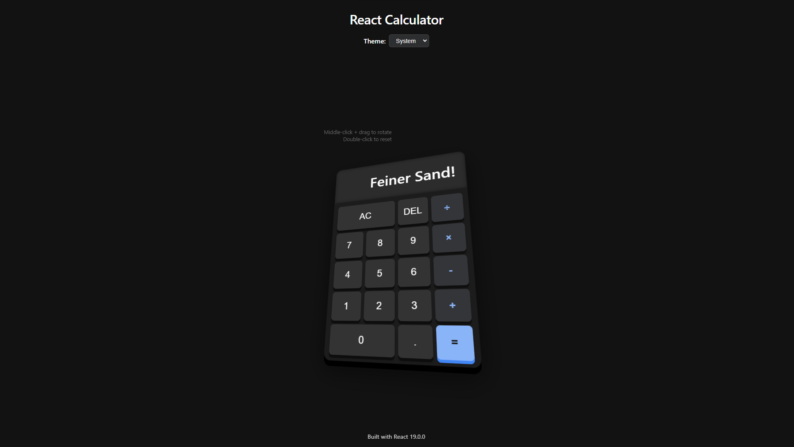

# React Calculator

A modern, interactive 3D calculator built with React and TypeScript. This calculator features a sleek design with 3D rotation capabilities, theme switching, and keyboard support.



## Features

- **3D Interaction**: Middle-click and drag to rotate the calculator in 3D space
- **Theme Support**: Choose between light, dark, and system themes
- **Keyboard Input**: Use your keyboard for calculations
- **Responsive Design**: Works on desktop and mobile devices

## Getting Started

### Prerequisites

- Node.js (v16 or higher)
- npm or yarn

### Installation

1. Clone the repository:
```sh
git clone https://github.com/leonxger/react-calc
cd react-calc
```

2. Install dependencies:
```sh
npm install
# or
yarn install
```

3. Start the development server:
```sh
npm start
# or
yarn start
```

4. Open your browser and navigate to `http://localhost:4200`

## Available Scripts

- `npm start` - Starts the development server
- `npm run build` - Creates a production build
- `npm test` - Runs the test suite

## Project Structure

```
react-calc/
├── src/
│   ├── app/
│   │   ├── components/
│   │   │   └── Calculator/
│   │   │       ├── Calculator.tsx
│   │   │       ├── Calculator.scss
│   │   │       ├── CalculatorDisplay.tsx
│   │   │       └── CalculatorKeypad.tsx
│   │   ├── hooks/
│   │   │   ├── useCalculator.ts
│   │   │   ├── useKeyboardInput.ts
│   │   │   ├── useRotation.ts
│   │   │   └── useTheme.ts
│   │   ├── utils/
│   │   │   └── calculator-utils.ts
│   │   ├── app.tsx
│   │   ├── app.scss
│   │   └── types.ts
│   ├── assets/
│   ├── main.tsx
│   └── styles.scss
├── public/
├── package.json
└── README.md
```

## Technologies Used

- React 19
- TypeScript
- SCSS for styling
- Vite for build tooling
- Nx for project management

## Contributing

1. Fork the repository
2. Create your feature branch (`git checkout -b feature/amazing-feature`)
3. Commit your changes (`git commit -m 'Add some amazing feature'`)
4. Push to the branch (`git push origin feature/amazing-feature`)
5. Open a Pull Request
